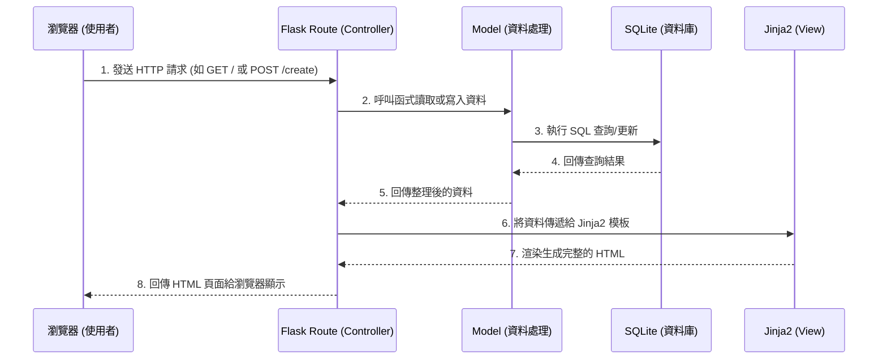

# 讀書筆記本專案 - 系統架構文件 (ARCHITECTURE)

## 1. 技術架構說明

本專案採用輕量級的網頁開發架構，不採用前後端分離，而是透過後端直接渲染 HTML 頁面返回給使用者。

- **後端框架**：**Python + Flask**。Flask 是一個輕量、靈活的微框架，非常適合快速開發中小型專案，且具備良好的擴展性。
- **模板引擎**：**Jinja2**。作為 Flask 內建的模板引擎，Jinja2 允許我們在 HTML 檔案中寫入邏輯（如迴圈、條件判斷），動態地將後端資料嵌入頁面中進行渲染。
- **資料庫**：**SQLite**。SQLite 是一個輕量級的關聯式資料庫，不需額外的伺服器設定，所有資料會儲存在一個本地檔案中，非常適合此專案的 MVP 階段。

**MVC 模式說明**：
- **Model（模型）**：負責與 SQLite 資料庫溝通，定義書籍、筆記、評論等資料結構，處理資料的儲存、查詢與更新。
- **View（視圖）**：負責使用者介面的呈現。在此專案中由 Jinja2 模板（`.html` 檔案）負責，接收從 Controller 傳來的資料並渲染成最終網頁。
- **Controller（控制器）**：由 Flask 的路由（Routes）擔任，負責接收使用者的 HTTP 請求（例如新增筆記、搜尋），呼叫對應的 Model 取得或寫入資料，最後將資料傳遞給 View 進行渲染。

## 2. 專案資料夾結構

建議的資料夾結構如下，以模組化的方式分離關注點：

```text
web_app_development/
├── app/
│   ├── models/           ← 資料庫模型 (Models)：定義與資料庫互動的邏輯
│   │   ├── __init__.py
│   │   └── database.py   ← 資料庫連線與 CRUD 操作函式
│   ├── routes/           ← Flask 路由 (Controllers)：處理使用者請求
│   │   ├── __init__.py
│   │   ├── book.py       ← 處理書籍與筆記的路由 (新增、編輯、列表)
│   │   └── search.py     ← 處理搜尋功能的路由
│   ├── templates/        ← Jinja2 HTML 模板 (Views)
│   │   ├── base.html     ← 共用佈局 (包含 Header, Footer)
│   │   ├── index.html    ← 首頁 / 筆記列表頁
│   │   ├── create.html   ← 新增 / 編輯筆記頁
│   │   └── detail.html   ← 筆記詳細內容與評論區
│   └── static/           ← 靜態資源檔案
│       ├── css/
│       │   └── style.css ← 網站樣式
│       └── js/
│           └── main.js   ← 簡單的互動邏輯
├── instance/
│   └── database.db       ← SQLite 資料庫檔案 (執行時自動生成)
├── docs/                 ← 文件存放區
│   ├── PRD.md            ← 產品需求文件
│   └── ARCHITECTURE.md   ← 系統架構文件 (本文件)
├── app.py                ← 應用程式入口點 (初始化 Flask 實例並註冊路由)
└── requirements.txt      ← Python 依賴套件清單 (如 Flask)
```

## 3. 元件關係圖

以下展示使用者在瀏覽器操作時，系統各元件之間的互動流程：



## 4. 關鍵設計決策

1. **選擇 Server-Side Rendering (SSR) 而非前後端分離**
   - **原因**：考慮到這是一個基礎的筆記系統，主要以表單提交和文字展示為主，沒有高度複雜的單頁應用 (SPA) 需求。使用 Flask + Jinja2 伺服器端渲染可以大幅降低開發門檻並加快 MVP 的完成速度。
2. **採用 SQLite 檔案資料庫**
   - **原因**：SQLite 零配置且不需額外架設資料庫伺服器。對於單人或輕量級的多人筆記系統，其效能完全足以應付，並使專案易於搬移與備份。
3. **根據功能拆分 Route 檔案 (Blueprints/模組化)**
   - **原因**：為避免所有的路由都寫在同一個 `app.py` 中造成日後難以維護，我們將路由按功能拆分至 `app/routes/` 之下。這能使程式碼結構更清晰，也方便未來擴充新功能。
4. **定義 `base.html` 作為共用模板**
   - **原因**：大多數網頁都有相同的導覽列或頁尾。透過 Jinja2 的模板繼承 (``)，我們可以避免重複撰寫相同的 HTML 結構，維持介面的一致性與未來修改的便利性。
