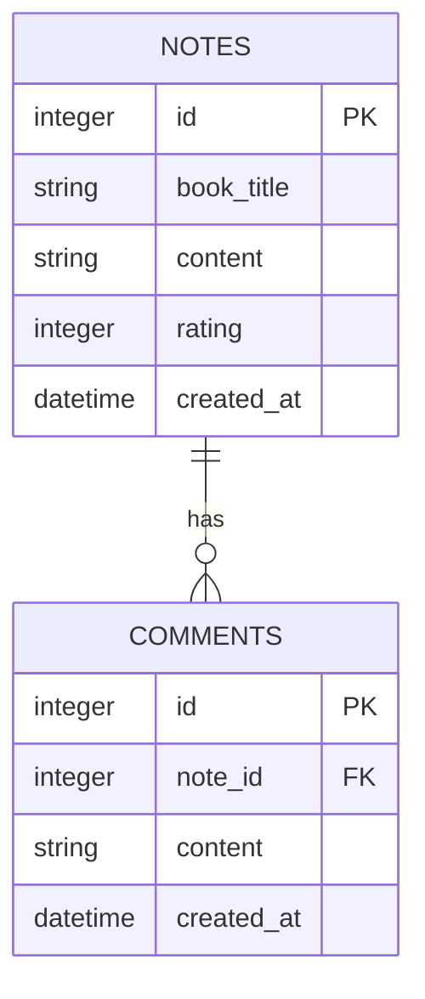

# 讀書筆記本專案 - 資料庫設計 (DB Design)

## 1. ER 圖（實體關係圖）

本系統使用兩張資料表，分別儲存筆記內容與留言評論。兩者為一對多的關聯（一筆筆記可以有多則評論）。

## 2. 資料表詳細說明

### 2.1 `notes` (筆記資料表)
儲存使用者的讀書筆記與評分資訊。

| 欄位名稱 | 型別 | 必填 | 說明 |
| --- | --- | --- | --- |
| `id` | INTEGER | 是 | Primary Key (Auto Increment)，筆記的唯一識別碼 |
| `book_title` | TEXT | 是 | 書本名稱 |
| `content` | TEXT | 是 | 讀書心得內容 |
| `rating` | INTEGER | 是 | 對這本書的評分（建議範圍 1-5） |
| `created_at` | DATETIME| 是 | 建立時間，預設為 `CURRENT_TIMESTAMP` |

### 2.2 `comments` (評論資料表)
儲存特定筆記底下的留言評論。

| 欄位名稱 | 型別 | 必填 | 說明 |
| --- | --- | --- | --- |
| `id` | INTEGER | 是 | Primary Key (Auto Increment)，評論的唯一識別碼 |
| `note_id` | INTEGER | 是 | Foreign Key，關聯至 `notes(id)`。設定 `ON DELETE CASCADE` 讓筆記刪除時自動刪除關聯評論 |
| `content` | TEXT | 是 | 評論留言的具體內容 |
| `created_at` | DATETIME| 是 | 建立時間，預設為 `CURRENT_TIMESTAMP` |
