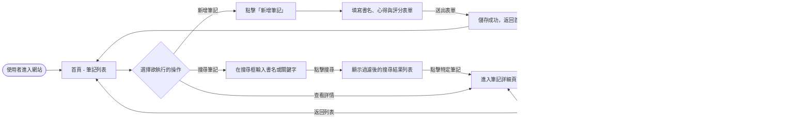
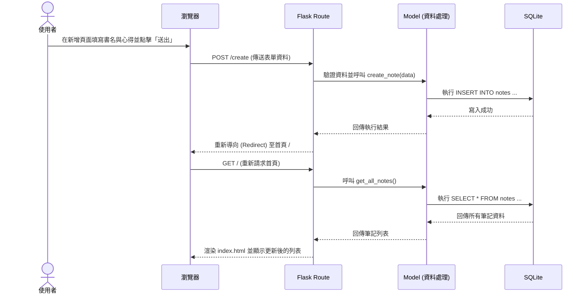

# 讀書筆記本專案 - 流程圖 (FLOWCHART)

## 1. 使用者流程圖 (User Flow)

此流程圖描述使用者進入網站後的各種操作路徑，包含瀏覽筆記列表、新增筆記、搜尋與留言評論的互動流程。

## 2. 系統序列圖 (Sequence Diagram)

此序列圖以「新增讀書筆記」為情境，展示從使用者操作到資料存入資料庫的完整技術流程：

## 3. 功能清單對照表

以下表格整理了系統中各個主要功能、對應的 URL 路徑以及 HTTP 請求方法，供後續 API 設計與前端開發時對齊介面：

| 功能名稱 | 描述 | URL 路徑 | HTTP 方法 |
| --- | --- | --- | --- |
| **筆記列表 (首頁)** | 顯示所有使用者的讀書筆記清單 | `/` | GET |
| **搜尋筆記** | 根據書名或內容關鍵字過濾筆記 | `/search` | GET |
| **新增筆記頁面** | 顯示用於新增筆記的表單頁面 | `/create` | GET |
| **儲存新筆記** | 接收表單資料，寫入資料庫並導回首頁 | `/create` | POST |
| **筆記詳細頁** | 顯示單一筆記的完整內容、評分與評論區 | `/note/<int:id>` | GET |
| **發表評論** | 接收評論表單資料，寫入資料庫並重新載入頁面 | `/note/<int:id>/comment` | POST |
